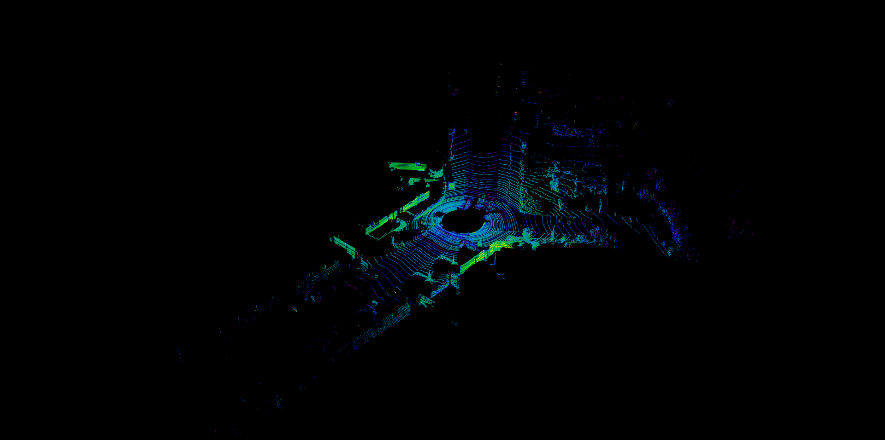

# SLAM_Module

## preprocessor
### ground filter
1. linefit
2. heightDiff in gridMap

#### result:
original frame, points num:124668
 

linefit(take scan ID < 40 as ROI), points num:46977

linefit(take scan ID < 50 as ROI), points num:33524

heightDiff in gridMap, thre = 0.5, points num:34983

heightDiff in gridMap, thre = 0.3, points num:34983

### segmentation
